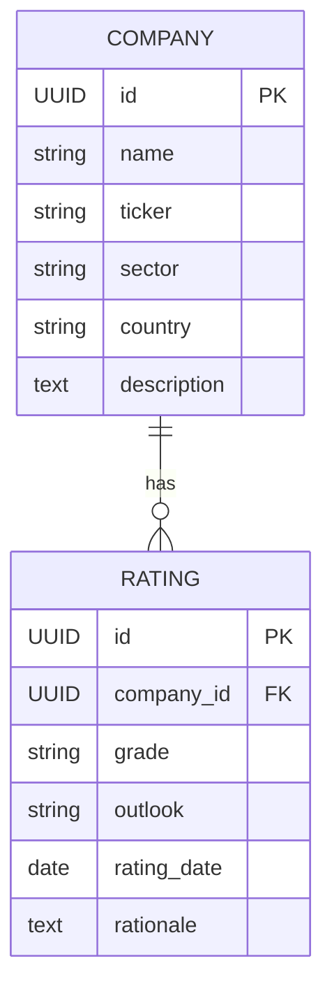

# Backend API

## Context and Design Philosophy

The backend is a Spring Boot 3.x (Java 21) REST API exposing the `Company`/`Rating` domain over PostgreSQL. It follows the standard layered architecture — `@RestController` → `@Service` → `@Repository` (Spring Data JPA) — deliberately, because the layering itself (and being able to explain *why* each layer exists) is part of what this project demonstrates. Controllers stay thin: request/response mapping and delegation only. Business rules (pagination defaults, filter composition) live in services. Data access is Spring Data JPA derived queries plus `Specification`s for dynamic filtering — no hand-rolled SQL unless a derived query genuinely can't express the need.

This LLD does not cover authentication/authorization mechanics (see `auth.md`) beyond noting which endpoints require which role.

## Domain Model

- `Company.ticker` is unique, uppercase, 1–10 chars.
- `Rating.grade` is constrained to a fixed enum: `AAA, AA, A, BBB, BB, B, CCC, CC, C, D`.
- `Rating.outlook` is constrained to `POSITIVE, STABLE, NEGATIVE`.
- A company's **current rating** is the `Rating` row with the most recent `rating_date` for that company (no separate "is_current" flag — derived by query, avoids a second source of truth).
- Deleting a `Company` cascades to delete its `Rating` history (a rating has no meaning without its company).

## API Endpoints

| Endpoint | Method | Auth | Request | Response |
|---|---|---|---|---|
| `/api/companies` | GET | public | query params: `page`, `size`, `sort`, `search`, `sector`, `country`, `grade` | `Page<CompanySummaryDto>` |
| `/api/companies/{id}` | GET | public | — | `CompanyDetailDto` (includes rating history) |
| `/api/companies` | POST | ADMIN | `CompanyCreateDto` | `CompanyDetailDto`, 201 |
| `/api/companies/{id}` | PUT | ADMIN | `CompanyUpdateDto` | `CompanyDetailDto`, 200 |
| `/api/companies/{id}` | DELETE | ADMIN | — | 204 |
| `/api/companies/{id}/ratings` | POST | ADMIN | `RatingCreateDto` | `RatingDto`, 201 |
| `/api/ratings/distribution` | GET | public | — | `List<RatingDistributionBucket>` (grade → count, current ratings only) |

`search` matches against `name` or `ticker` (case-insensitive, partial). `sector`, `country`, `grade` are exact-match filters, combinable with `search` and with each other (AND semantics). `sort` accepts any of `name`, `ticker`, `sector`, `currentGrade` with optional `,desc`.

Rating history for the trend chart is embedded in `CompanyDetailDto` (a company's full rating list, ordered by date) rather than a separate endpoint — one request per detail-view page load, no N+1 from the frontend's perspective.

**Ratings are append-only.** There is deliberately no `PUT`/`DELETE` for an individual `Rating` — mirroring how real rating agencies operate (a rating is never retroactively rewritten; a change is expressed by issuing a new rating with a new date). A data-entry mistake is corrected by adding a new `Rating` row, not editing history. `Company` remains fully editable/deletable (name, sector, description, etc. are metadata, not a historical record). The frontend's detail-page "Edit"/"Delete" controls (per `frontend.md`) apply to the `Company` only; the only rating-level admin action is "add a new rating."

## Pagination, Filtering, Sorting

- `Pageable` (Spring Data) drives `page`/`size`/`sort` — default `size=20`, max `size=100` (reject larger with `400`).
- Dynamic filters (`search`, `sector`, `country`, `grade`) are composed via JPA `Specification`s in the service layer, not baked into a single derived-query method name — keeps the combinatorial filter space from exploding into dozens of `findByXAndYAndZ` methods.
- Sorting on `currentGrade` requires a join against each company's latest rating; implemented via a subquery in the `Specification`, not an in-memory sort (would break pagination correctness).

## Validation & Error Handling

- Request DTOs use Bean Validation (`@NotBlank`, `@Pattern` for ticker format, `@Size`, custom `@ValidGrade`/`@ValidOutlook` if simple enum validation isn't sufficient).
- A single `@RestControllerAdvice` maps exceptions to a consistent JSON error shape: `{ "status": int, "error": string, "message": string, "path": string, "timestamp": ISO8601 }`.
  - `MethodArgumentNotValidException` → `400` with field-level messages.
  - `EntityNotFoundException` (custom) → `404`.
  - `DataIntegrityViolationException` (e.g. duplicate ticker) → `409`.
  - Unhandled → `500`, generic message (no stack trace leaked to client).

## DTOs vs Entities

Entities are never returned directly from controllers. Two reasons: (1) `Company ↔ Rating` is bidirectional, and serializing the entity graph directly risks infinite recursion or accidental over-fetching; (2) DTOs let the API shape (`CompanySummaryDto` for list views vs `CompanyDetailDto` with embedded ratings) diverge from the storage shape without either side leaking into the other. Mapping is done with a small hand-written mapper class per entity (not MapStruct/ModelMapper) — the domain is small enough that a code-generation dependency isn't worth the interview-explanation overhead it would add.

## API Documentation

`springdoc-openapi` auto-generates the OpenAPI spec from controller annotations; `/swagger-ui.html` is publicly reachable (read-only, no auth) so a reviewer can explore and try endpoints without a token for the `GET` routes.

## Edge-Case Behavior

Resolved during the Phase 2 edge-case probe — stated explicitly so none of these are left to implementer discretion:

- **Company with zero ratings**: `currentRating` on `CompanySummaryDto`/`CompanyDetailDto` is `null`; rating history is `[]`. `/api/ratings/distribution` always returns all 10 grade buckets, zero-count buckets included (never omitted), so the chart's axis is stable regardless of data sparsity.
- **Duplicate ticker**: uniqueness check is case-insensitive (ticker normalized to uppercase before comparison); violation → `409`.
- **Invalid filter/sort values** (`?grade=FOO`, `?sort=notAField`, `?sort=currentGrade,sideways`): rejected with `400` via Bean Validation / explicit allow-list check in the service — never a silent no-match and never a `500` from an enum-conversion failure.
- **Pagination boundaries**: `page` beyond the last page returns an empty `content[]` with valid, well-formed metadata (`totalPages`/`totalElements` still correct) — not an error. Negative or zero `size`/`page` → `400`.
- **Ordering determinism**: every sort always appends `id` as a secondary sort key, so two rows with equal primary-sort values (same `name`, same `currentGrade`) still paginate deterministically across requests.
- **Same-day rating tie-break**: when two `Rating` rows for one company share the same `rating_date`, the one with the higher `id` (most recently inserted) is "current."
- **Concurrent writes**: explicitly **not** guarded by optimistic locking (no `@Version`). A last-write-wins race is an accepted gap given single-admin, low-traffic usage — stated here so it reads as a decision, not an oversight.
- **Rating POST to a nonexistent company**: checked explicitly in the service before insert, returning `404` — never allowed to fall through to a raw FK-violation `500`.
- **Delete on an already-deleted or nonexistent id**: `404`, not an idempotent `204` — consistent with GET/PUT behavior on missing ids.

## Decisions & Alternatives

| Decision | Chosen | Alternatives Considered | Rationale |
|---|---|---|---|
| Filtering mechanism | JPA `Specification` composed in service | Derived query methods per filter combo; native SQL via `@Query` | Specifications scale to combinable filters without a combinatorial explosion of repository methods |
| Entity ID type | `UUID` | Auto-increment `Long` | UUIDs avoid leaking row-count/creation-order information via a public API — minor but free hardening, and a natural talking point on API design |
| Mapping entity↔DTO | Hand-written mapper classes | MapStruct, ModelMapper | Domain is 2 entities; a mapping library adds a dependency and a build-time codegen step to explain for no real benefit at this scale |
| Current rating derivation | Computed (most recent `rating_date`) | Stored `is_current` boolean flag on `Rating` | Avoids a second source of truth that could drift out of sync with the actual history |
| Rating history delivery | Embedded in `CompanyDetailDto` | Separate `/companies/{id}/ratings` GET endpoint | One request per detail-page load; simpler frontend data-fetching story |

## Open Questions & Future Decisions

### Resolved
1. ✅ Cascade delete of ratings on company delete — acceptable since ratings have no independent meaning.

### Deferred
1. Full-text search relevance ranking — current `search` is a simple case-insensitive `LIKE`; acceptable at seed-data scale (a few dozen companies).
2. Rate limiting on public `GET` endpoints — not needed for a low-traffic portfolio demo; noted as a real-world gap, not implemented.

## References

- `docs/high-level-design.md` — System Design, Core Entities.
- `docs/llds/auth.md` — role requirements referenced in the endpoint table above.
