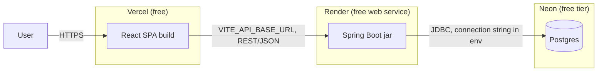

# Deployment & CI

## Context and Design Philosophy

Two deployment targets must stay in sync: a local Docker Compose stack (the reliable fallback, always fresh) and a live free-tier deployment (the primary way a reviewer experiences the app, per HLD Key Design Decision #6). Both must boot from the same seeded, populated state with zero manual steps. This LLD also covers CI, since "does the test suite actually run on every push" is part of the same "does this project actually work, unattended" concern.

## Local: Docker Compose

Three services in `docker-compose.yml`:

| Service | Image/Build | Notes |
|---|---|---|
| `db` | `postgres:16` | named volume for persistence across restarts; healthcheck gates dependent services |
| `backend` | built from `backend/Dockerfile` (multi-stage: Maven build → JRE runtime) | waits on `db` healthcheck; runs Flyway migrations on boot |
| `frontend` | built from `frontend/Dockerfile` (multi-stage: `npm run build` → static served via nginx) or `npm run dev` for a dev-mode compose override | `VITE_API_BASE_URL` points at `backend` service name over the compose network |

`docker compose up` is the entire local setup story — no separate migration step, no manual seed script invocation.

## Schema & Seed Data: Flyway

- Schema managed via **Flyway** migrations (`backend/src/main/resources/db/migration/`), not JPA `ddl-auto: update`. Chosen over a `CommandLineRunner`-based seeder because versioned migrations are the real-world professional pattern, run identically against local Postgres and live Neon Postgres, and are a stronger, more concrete "I understand schema management" talking point than an ad hoc runtime seeder.
- `V1__init_schema.sql` — creates `company`, `rating`, `app_user` tables.
- `V2__seed_data.sql` — inserts ~15–20 realistic sample companies across a spread of sectors/countries, each with 2–4 historical ratings (to make the trend chart meaningful), plus the two seeded auth users (`admin`/`viewer`) referenced in `auth.md`.
- Flyway runs automatically on backend startup in both environments — first boot against a fresh Neon database performs the same migration + seed as a fresh local Postgres container.

## CI: GitHub Actions

Two jobs, both triggered on push and PR:

- **backend** — `mvn test` (or `./gradlew test`, per whichever build tool is chosen at implementation time), which includes both the JUnit unit tests and the `@SpringBootTest`/MockMvc integration tests. Testcontainers spins up a real Postgres inside the GitHub Actions runner (Docker is available natively on `ubuntu-latest` runners — no extra setup needed).
- **frontend** — `npm ci && npm run build` (and lint, if configured) — catches TypeScript/build errors before merge; full frontend test coverage is not a stated HLD goal, so this job stays a build/lint gate rather than a test-runner.

A failing job blocks the PR from looking green — this is what makes the HLD's "GitHub Actions runs on every push" success metric checkable by looking at the repo, not just asserted in the README.

## Live Deployment Topology

- **Vercel**: builds `frontend/` on push to `main` (connected directly to the GitHub repo); `VITE_API_BASE_URL` set as a Vercel project env var pointing at the Render backend's public URL.
- **Render**: builds `backend/` from its `Dockerfile` (the same one used by Docker Compose — one Dockerfile, two consumers, no drift between local and live build definitions) as a free Web Service. Env vars: `DATABASE_URL`/`DATABASE_USERNAME`/`DATABASE_PASSWORD` (Neon connection string), `JWT_SECRET`.
- **Neon**: a single free-tier Postgres project; connection string wired into Render's env config. Chosen over Render's own free Postgres per HLD Key Design Decision #8 (no auto-expiry).
- **Cold start**: Render's free tier spins the backend down after ~15 minutes idle. The frontend's API client (see `frontend.md`, spec `FE-UI-016`) shows a distinct "waking up the server, this can take up to a minute" loading state when a request is still pending after ~5 seconds, rather than looking indistinguishable from a hang — a small UX touch that turns a free-tier limitation into a handled, explained state instead of an apparent bug. This behavior is owned by the frontend arrow segment even though it's motivated by backend/infra topology — the code lives in frontend, so the spec does too.

## Failure Modes & Recovery

Resolved during the Phase 2 edge-case probe:

- **Failed Flyway migration on Render**: Render's own deploy model already handles this — it does not cut traffic over to a new deploy until it passes health checks, so a broken migration leaves the last-known-good version serving live traffic instead of taking the site down. This is the de facto rollback mechanism; no separate rollback tooling is built.
- **Redeploy re-running seed data**: prevented by Flyway's own `flyway_schema_history` bookkeeping — `V2__seed_data.sql` applies exactly once per database. Stated explicitly rather than left implicit.
- **Compose `db` healthcheck**: uses `pg_isready` as the actual healthcheck command (not a bare "container started" signal); Spring's own JDBC/Hikari connection retry on startup is a second layer of defense if the backend still starts a beat too early.
- **CI Testcontainers job**: given an explicit 10-minute job-level timeout in the GitHub Actions workflow, so a hung Postgres container fails loudly instead of consuming the platform's multi-hour default timeout.
- **Docker Hub pull rate limits / Neon free-tier limits hit**: both accepted as low-probability risks with no special handling — errors surface through existing error paths (failed CI run, failed DB connection) rather than being specifically mitigated.
- **Env var drift** between local `.env` and the Render/Vercel dashboards: `.env.example` is the documented single source of truth for variable *names* (never values/secrets); no automated sync exists. Accepted given the surface is ~3 variables (`DATABASE_URL`, `JWT_SECRET`, `VITE_API_BASE_URL`).
- **`JWT_SECRET` provisioning**: a fixed, clearly-labeled dev-only value ships in `.env.example` for local Compose; the live secret is generated once via `openssl rand -base64 32` and set directly in Render's dashboard. No rotation policy — rotation would just invalidate all live tokens per `auth.md`.
- **Cold-start wake-up UX**: if the "waking up" state (triggered after ~5s, per `frontend.md`) is still pending past 60s, it switches to a persistent "service may be waking up — try refreshing in a moment" message rather than spinning indefinitely.
- **Concurrent Flyway runs** (e.g. Render restarting the backend twice in quick succession): safe by Flyway's own default schema-level advisory lock — not a gap requiring new design.

## Decisions & Alternatives

| Decision | Chosen | Alternatives Considered | Rationale |
|---|---|---|---|
| Schema/seed mechanism | Flyway migrations | `CommandLineRunner` + `ddl-auto: update` | Versioned migrations are the real-world pattern, work identically local vs. live, and are a stronger interview talking point |
| Backend build artifact | Single `Dockerfile`, used by both Compose and Render | Separate build configs per target (buildpack for Render, Dockerfile for Compose) | One build definition removes an entire class of "works locally, breaks live" drift |
| Cold-start UX | Explicit "waking up" loading state after a delay threshold | Silent spinner indistinguishable from a hang; no handling | Turns a known free-tier limitation into an intentionally-designed state rather than an apparent bug |
| CI test execution | Testcontainers-backed Postgres in GitHub Actions | In-memory H2 for CI speed | Matches HLD Key Design Decision #10 — integration tests should exercise real Postgres behavior, not an H2 substitute |

## Open Questions & Future Decisions

### Resolved
1. ✅ One Dockerfile shared by Compose and Render — resolved above.

### Deferred
1. Render's free-tier policies (sleep timing, build minutes) may change over the life of the project; if the free tier becomes unusable, the fallback is Docker Compose plus a note in the README, not an immediate migration.
2. Neon connection pooling (PgBouncer) — Neon's free tier includes a pooled connection string option; not yet evaluated whether Spring's default HikariCP pool needs it at this traffic scale. Revisit only if live requests start failing under concurrent load, which is unlikely for a portfolio demo.

## References

- `docs/high-level-design.md` — Key Design Decisions #6, #7, #8 (deployment topology rationale).
- `docs/llds/backend-api.md`, `docs/llds/auth.md` — what gets deployed.
